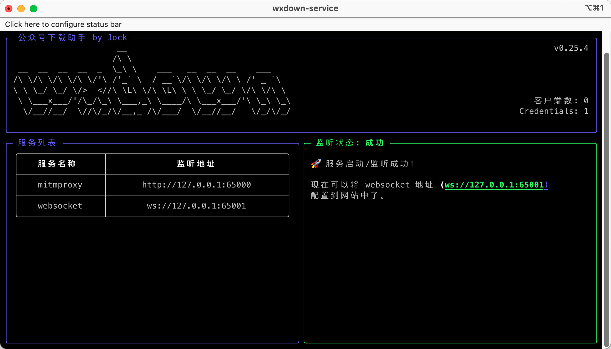

### English Summary

**Wechat Article Exporter** is a browser-based frontend application designed to help users export and manage WeChat public account content. The tool works in combination with a backend service that intercepts and processes WeChat data.

This frontend is built with Nuxt.js and Tailwind CSS, and provides an intuitive interface for viewing, filtering, and exporting articles. Users can see login credentials, flow lists, certificate status, and more through visual panels and settings.

It is intended for Chinese-speaking users, but the interface is designed to be clean and navigable. The project includes detailed screenshots and is fully open source.

 wxdown-service



## 使用

在控制台执行 `./wxdown-service` 或者双击对应的可执行文件即可，根据控制台的提示进行操作，直至最终出现【🚀 服务启动/监听成功！】。

接下来，将 websocket 地址配置到网站中。


## 自定义构建

由于 macOS 系统要求必须签名才能分发应用程序，所以从 [Releases](https://github.com/wechat-article/wxdown-service/releases) 下载的 macOS 版本不一定能用，这种情况下
推荐从源码自己进行构建。构建步骤如下：

> 如果有大佬知道其他能够解决签名问题的话，不惜赐教。

### 1. 下载源码
```shell
git clone git@github.com:wechat-article/wxdown-service.git
```

### 2. 配置环境 & 安装依赖

> 推荐使用 python 3.12 进行构建

```shell
# 创建虚拟环境
python3 -m venv .
source bin/activate

pip3 install -r requirements.txt
pip3 install pyinstaller
```

### 3. 打包
```shell
pyinstaller -y --clean wxdown-service.spec
```

### 4. 运行
```shell
cd dist/wxdown-service
./wxdown-service
```

## 常见问题

### 1. 启动程序时出现【启动 mitmproxy 失败，请切换端口进行重试】

该程序启动 mitmproxy 时的默认端口为 65000，如果出现该错误，表示端口已被占用，可通过 `-p` 选项指定其他端口

```shell
./wxdown-service -p 65001
```

### 2. 出现其他类型的错误，可查看程序的日志文件

日志文件位于程序目录下的`_internal/resources/logs/wxdown.log`


## 功能说明

第一版是一个命令行程序，没有图形界面，使用 pyinstaller 进行打包。

1. 启动 mitmproxy 服务进程，并加载 credential.py 插件，拦截微信流量并写入 credentials.json 文件
2. 启动 watcher 服务进程，监听 credentials.json 文件的变动，并通过 websocket 通知浏览器
3. 检查证书是否安装，若没有安装，则提示手动安装后继续
4. 检查网络代理是否设置正确，若设置有误，则提示手动设置后继续
5. 最后，提示成功

## 打包命令(pyinstaller)

```shell
pyinstaller -y --clean -D -c -n wxdown-service --add-data=resources/credential.py:resources main.py
```

### 参数说明

- `-D` 打包为一个目录
- `-c` 打开控制台窗口用来输入/输出
- `-add-data` 添加资源文件
